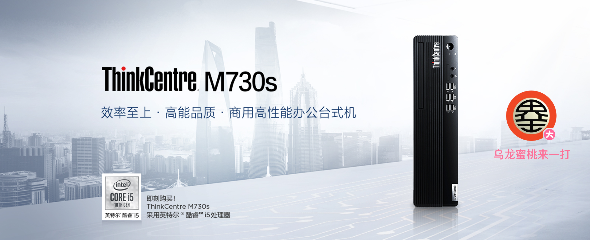
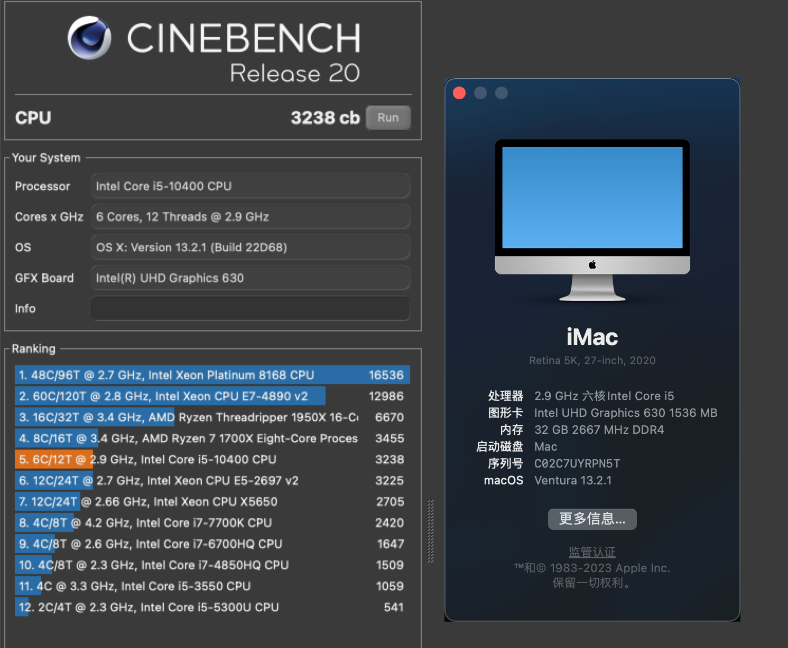
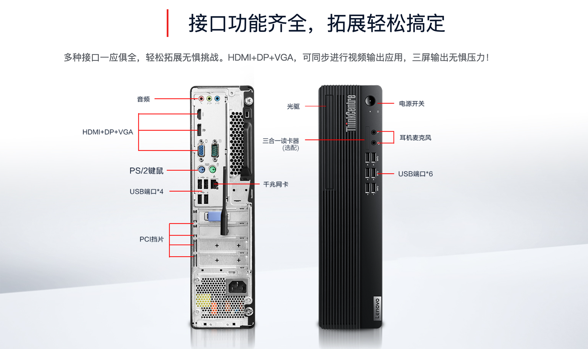

## Lenovo-ThinkCentre-M730s Intel Gen10 Hackintosh OpenCore EFI



### [简体中文](README.zh_CN.md)

### OpenCore

[OpenCore 1.0.4](https://github.com/acidanthera/OpenCorePkg)

### OS Version Tested

- macOS Monterey 12.x
- macOS Ventura   13.x 
- macOS Sonoma  14.x
- macOS Sequoia  15.x  

### Hardware

- Motherboard: Lenovo H470
- Bios Version: 
- CPU: Intel i5-10400
- RAM: KINGBANK 16G DDR4 3200 + PNY 16G DDR4 3200
- SSD: HIKVISION C2000 PRO 512G
- iGPU: Intel UHD Graphic 630
- Audio: 1Realtek ALC623
- Ethernet Card: Realtek RTL8111
- PSU: HuntKey 210W

### BIOS

```
Devices
  |-- ATA Drive Setup
    |-- Configure STAT as: ACHI
  |-- Video Setup
    |-- Select Active Video: IGD
    |-- Pre-Allocated Memory Size: 64MB
    |-- Total Graphics Memory: Maximum

Advanced
  |-- CPU Setup
    |-- Intel(R) Hyper-Threading Technology: Enabled
    |-- Core Multi-Processing: Enabled
    |-- Intel(R) Virtualization Technology: Enabled

Power
  |-- Automatic Power On
    |-- Wake on LAN: Disabled
    
Security
  |-- Secure Boot
    |-- Secure Boot: Disabled

Startup
  |-- Fast Boot: Disabled
```

### Notes
 - Use [OCAuxiliaryTools](https://github.com/ic005k/OCAuxiliaryTools/releases) build your SMBIOS
 - U Must Use CFGLock.efi Tool Unlock CFG LOCK first


### Known issues

- No Wireless LAN Adapter，So `WiFi` and `Bluetooth` unserviceable .

### ScreenShot

 - about this mac & Cinebench R20



### Case



### Contact Us

 - QQ Group: 23304408

