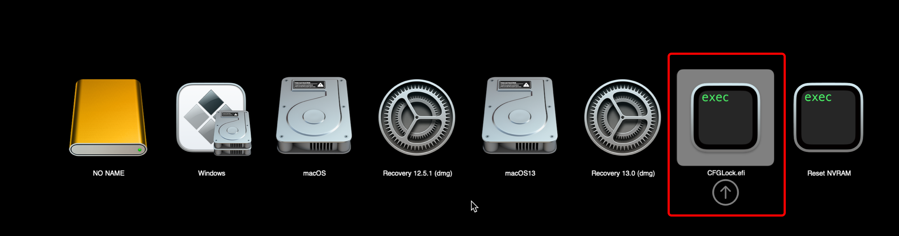
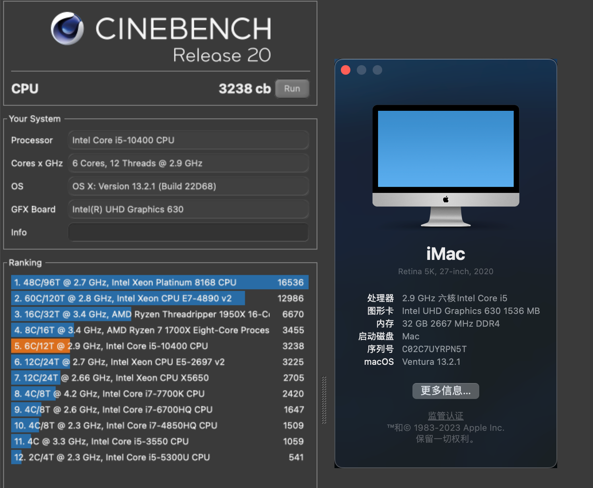
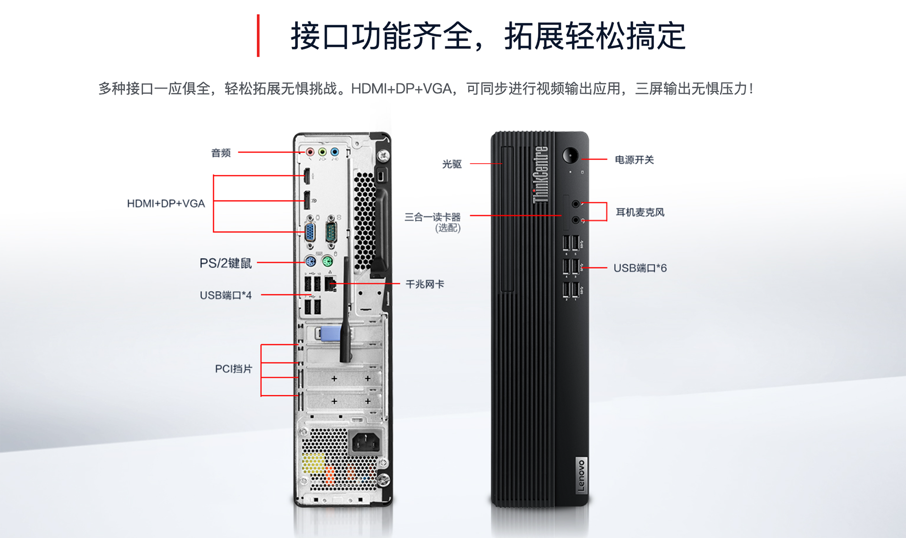

## Lenovo-ThinkCentre-M730s Intel Gen10 Hackintosh OpenCore EFI


### [English](https://github.com/hackintosh-club/Lenovo-ThinkCentre-M730s)

### OpenCore

[OpenCore 1.0.4](https://github.com/acidanthera/OpenCorePkg)

### 已测试系统

- macOS Monterey 12.x
- macOS Ventura   13.x 
- macOS Sonoma  14.x
- macOS Sequoia  15.x  

### 硬件

- Motherboard: Lenovo H470
- Bios Version: 
- CPU: Intel i5-10400
- RAM: KINGBANK 16G DDR4 3200 + PNY 16G DDR4 3200
- SSD: HIKVISION C2000 PRO 512G
- iGPU: Intel UHD Graphic 630
- Audio: 1Realtek ALC623
- Ethernet Card: Realtek RTL8111
- PSU: HuntKey 210W

### BIOS设置

```
Devices
  |-- ATA Drive Setup
    |-- Configure STAT as: ACHI
  |-- Video Setup
    |-- Select Active Video: IGD
    |-- Pre-Allocated Memory Size: 64MB
    |-- Total Graphics Memory: Maximum

Advanced
  |-- CPU Setup
    |-- Intel(R) Hyper-Threading Technology: Enabled
    |-- Core Multi-Processing: Enabled
    |-- Intel(R) Virtualization Technology: Enabled

Power
  |-- Automatic Power On
    |-- Wake on LAN: Disabled
    
Security
  |-- Secure Boot
    |-- Secure Boot: Disabled

Startup
  |-- Fast Boot: Disabled
```

### 注意事项
 - 使用[OCAuxiliaryTools](https://github.com/ic005k/OCAuxiliaryTools/releases)生成SMBIOS
 - 在OpenCore引导界面，按空格键后选择CFGLock.efi工具解锁主板CFG Lock


### 已知问题

- 原机没有无线网卡硬件，故wifi和蓝牙无法使用 .

### 系统截图

 - about this mac & Cinebench R20



### 机箱



### 联系我们

 - QQ Group: 23304408

